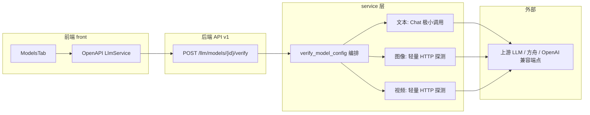
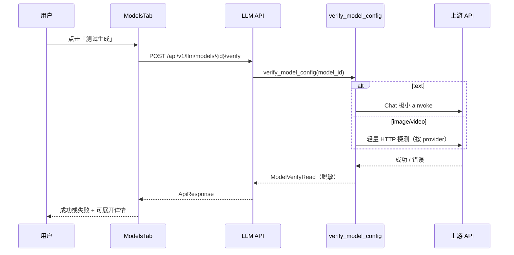

# Implementation Plan: 模型配置验证（模型管理）

**Workspace**: `test-llm-model-config` | **Date**: 2026-05-06 | **Spec**: [spec.md](spec.md) | **Explore**: [explore.md](explore.md)  
**Input**: Feature specification from `specs/test-llm-model-config/spec.md`

---

## Summary

在「模型管理」中为每条已保存模型提供**真实可用的配置验证**：前端接通列表/卡片/详情中的「测试生成 / 快速测试」入口；后端新增**同步、短超时**的验证 API，按模型类别（文本 / 图像 / 视频）执行**与 Spec 一致的探测深度**（文本：极小对话请求；图像/视频：鉴权与连通及与模型标识相关的轻量校验，**不**完成真实成片/成图）。响应包含成功/失败摘要，以及**脱敏后的详情**字段供排错；**管理员专属详情**与当前全站 API 缺少统一用户模型之间存在差距，在 Notes 中给出分期策略。

---

## Architecture Overview



---

## Key Design Decisions

### Decision 1: 验证 API 形态（同步 POST vs 异步任务）

- **背景**: Spec 明确本期不进入任务中心重流程；用户期望「点一次很快有结论」。
- **选项**:
  - A: **同步 HTTP**：单请求内完成探测，超时由服务端控制（如 15–30s 上限）。
  - B: 异步任务 + 轮询：更接近生成管线，但复杂度高、与「配置侧快速验证」不符。
- **结论**: **A — 同步 POST** `.../llm/models/{model_id}/verify`（或项目命名惯例下的等价路径），返回统一 `ApiResponse` 承载结果 DTO。
- **后果**: 长耗时上游可能影响 Worker/请求线程；需严格超时与错误归类，避免阻塞过久。

### Decision 2: 图像/视频「不生成」前提下的探测策略

- **背景**: Resolved Decision **B** 要求不做真实最小成片/成图；仍需尽量发现「模型名/鉴权错误」。
- **选项**:
  - A: 对所有 provider 统一「假请求拿 401/404」——语义脏、难维护。
  - B: **按 `provider_key` 分支**：OpenAI 兼容系优先 `GET {base}/models`（或等价列表）+ 校验配置中的 `model.name` 是否出现；火山等再查文档或使用次优轻量 endpoint；自定义/未注册维持现有 503。
  - C: 直接调用 `ImageGenerationTask` 最小 prompt——违背 Spec。
- **结论**: **B**；火山若缺官方轻量接口，在实现阶段选定**文档化**的次优方案并记入 `explore.md` [待确认] 闭环。
- **后果**: 新增代码需集中在一处「探测策略」模块，避免散落在 route 里。

### Decision 3: FR-006「详情仅管理员」与现状 API 无用户上下文

- **背景**: `explore.md` 指出当前后端未见与 LLM 路由绑定的统一 `current_user`。
- **选项**:
  - A: 首期 **所有登录用户** 收到相同 `detail`（仅含脱敏字段）——不满足 Spec 字面。
  - B: **响应拆分**：`summary`（人人可见）+ `detail`（默认 `null`）；接入权限后再对特权用户填充 `detail`。
  - C: 仅前端隐藏「展开」——可被直接调 API 绕过。
- **结论**: **B + 前端默认折叠**：后端 `detail` 字段结构预留；**在尚无 RBAC 的首期**可将 `detail` 设为与 `summary` 等价的脱敏摘要，或统一 `null`，并在 `Notes` 标明与 Spec 的临时差距；**禁止**在 `detail` 中返回密钥。
- **后果**: 后续若引入用户体系，只需在 API 层填充 `detail` 而不改前端契约形状。

---

## Module Design

### Module: `app/services/llm` — 模型验证编排

**职责**: 按 `model_id` 加载 `Model` 与 `Provider`，校验类别与供应商状态，分派到类别探测；统一脱敏与错误归类。

**改动概述**: 新增模块（建议文件名 `model_verify.py` 或 `verify_model.py`）暴露 `verify_model_config(db, model_id) -> ModelVerifyResult`；**不**修改现有 CRUD 语义。

**新增/变更接口**（伪代码）:

```
// 伪代码
function verify_model_config(db, model_id: str) -> ModelVerifyResult:
  model = load_model_or_404(model_id)
  provider = load_provider_or_fail(model.provider_id)
  assert_model_provider_consistency(model, provider)  // 类别/禁用/注册 key
  switch model.category:
    case text:
      return probe_text_chat(model, provider)
    case image:
      return probe_image_provider(model, provider)
    case video:
      return probe_video_provider(model, provider)
```

**核心流程变更**（伪代码）:

```
1. 解析 Model + Provider（已有 resolver / db.get 模式）
2. 复用 resolve_provider_config_from_provider 或等价校验（自定义供应商维持现有失败语义）
3. 文本：构造 Chat 实例（与 resolver._build_chat_openai_model 同参策略）→ ainvoke 固定极短 human 消息 → max_tokens 极小
4. 图像：按 provider_key 调用 probe 适配器（如 openai: GET models + 名称匹配）
5. 视频：按 provider_key 调用 probe 适配器（volcengine: 待文档确认）
6. 组装 ModelVerifyResult：ok, message, category, elapsed_ms, detail(脱敏)
7. 异常映射：401/403 → 鉴权类；404 → 模型/资源；timeout → 超时；其它 → 上游不可用或参数不接受
```

> **决策**: 文本 Chat 构造逻辑与 `resolver._build_chat_openai_model` **DRY**：优先提取 package 内私有/公共工厂方法，避免第三份复制。

> **[Tasks 阶段修正]**: `resolver.build_chat_model_from_provider` 已存在，但会选取该供应商下 **任意一条** 最新文本模型（`order_by updated_at`），**不能**直接用于「按 `model_id` 验证」。实现阶段应新增「显式传入 `Model` + `Provider`」的工厂（例如 `build_chat_model_for_model`），内部仍复用 `_build_chat_openai_model`。

### Module: `app/api/v1/routes/llm.py`

**职责**: 暴露 HTTP 契约，转调 service。

**改动概述**: 新增 `POST` 路由（路径在 OpenAPI 与前端生成中保持一致）；返回 `ApiResponse[ModelVerifyRead]`。

**核心流程**（伪代码）:

```
1. 接收 model_id（path）
2. verify_model_config(db, model_id)
3. success_response(result)
```

### Module: `app/schemas/llm.py`

**职责**: Pydantic 模型定义。

**改动概述**: 新增 `ModelVerifyRead`（或命名一致的前后端字段），含 `detail` 可选对象（字符串键值 + 明确不包含 secret）。

### Module: `front/.../ModelsTab.tsx`

**职责**: 用户入口与结果展示。

**改动概述**: 为表格/卡片/详情按钮绑定同一 `handleVerifyModel(record)`；**进行中** `loading` 状态 + **防重复**（忽略二次点击）；**AbortController** 或组件 unmount 时取消 UI 等待（符合 Spec「离开即取消等待」）；结果用 `Modal` 或 `message` + 可折叠 `Collapse` 展示详情。

> **决策**: 重复点击：**前端**禁用按钮 + **后端**幂等非必须（单次请求即可）；以前端为准满足 FR-005。

### Module: （可选）`ProvidersTab.tsx` 真连接

**职责**: 与模型验证一致的「供应商探测」体验。

**改动概述**: **非 Spec 必选项**；若同期修复，应调用独立 `POST /llm/providers/{id}/verify` 或复用轻量 ping，避免长期保留假 `setTimeout`。

---

## Sequence Diagrams

### US1: 对已保存模型发起一次配置验证



---

## Project Structure

### Source Code Changes

```text
specs/test-llm-model-config/
├── explore.md              [已生成] 探索基线
├── plan.md                 [本文件]
└── contracts/
    └── openapi.yaml        [已生成] 契约草案（供 openapi:update 对齐参考）

backend/app/
├── api/v1/routes/llm.py           [修改] 新增 verify 路由
├── schemas/llm.py                 [修改] 新增 ModelVerifyRead（及嵌套 DTO 若需要）
├── services/llm/
│   ├── model_verify.py            [新增] 验证编排 + 分 provider 探测（名称可调整）
│   └── resolver.py                [修改] 可选：抽取 build_chat_for_model 供复用
└── tests/
    └── test_llm_model_verify.py   [新增] httpx Mock / 依赖注入式单测

front/src/pages/aiStudio/models/
└── ModelsTab.tsx                  [修改] 接通按钮 + 展示 + loading/abort

front/（生成物）
├── openapi.json                   [变更] openapi:update 后
└── src/services/generated/        [变更] 生成客户端
```

---

## Design Artifacts

| 产物 | 本 run 是否生成 | 说明 |
|------|-----------------|------|
| explore.md | 是 | 事实 / 推断 / 待确认 |
| plan.md | 是 | 本文件 |
| data-model.md | **否** | 无新持久化实体 |
| contracts/openapi.yaml | 是 | 草案；以仓库内最终 OpenAPI 为准 |

---

## Notes

- **与 Spec 的临时差距**: FR-006 要求「详情仅管理员」；当前后端无统一用户模型时，建议 **API 返回结构预留 `detail`，首期填入脱敏公共摘要或 `null`**，并在发版说明中写明待 RBAC 收紧。
- **供应商「测试连接」**: 当前前端为假实现；模型验证落地后，建议另开小任务将供应商测试接同一探测基础设施，避免双份逻辑。
- **自定义供应商**: 维持 `resolve_provider_config` 现有 503；验证失败文案应引导「注册适配器或改用内置供应商」。
- **火山轻量探测**: 见 `explore.md` [待确认]；若阻碍排期，可在 tasks 阶段先实现 OpenAI 系 + 文本全量，volcengine 单列子任务。
- **验证命令**: 后端 pytest 新增文件；前端 `pnpm exec tsc --noEmit`；OpenAPI `pnpm run openapi:update`；Python `pylint` 覆盖新模块（见 `AGENTS.md`）。

---

## 建议下一步

执行 **`tasks`**：将本 plan 拆为可执行测试与实现顺序（API → service 探测策略 → 前端 → openapi 同步 → 文档 architecture 若行为变化）。
