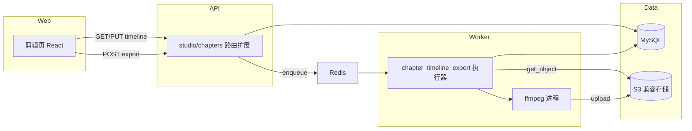
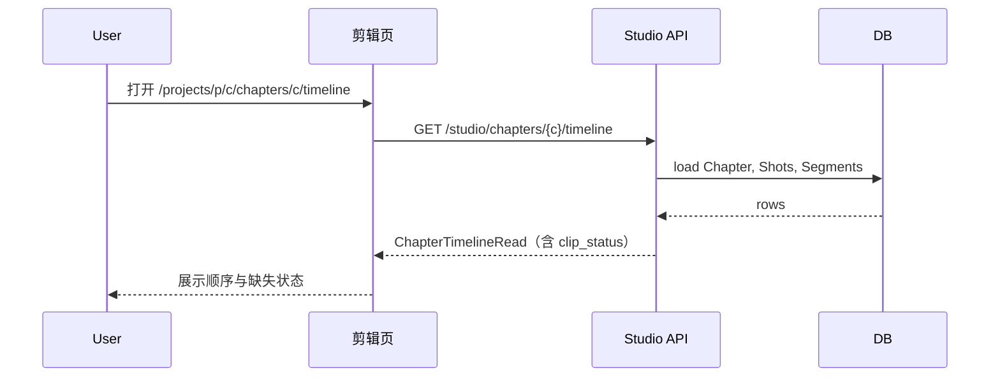
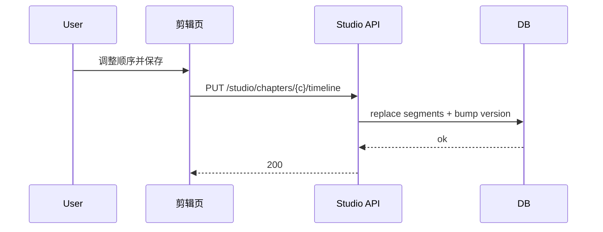
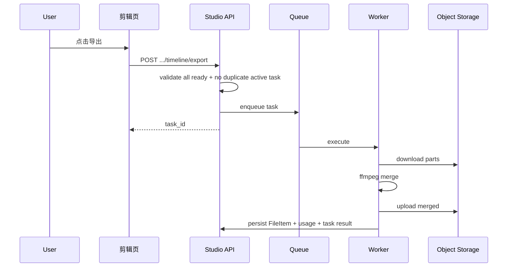

# Implementation Plan: 章节视频剪辑与时间线导出

**Workspace**: `video-timeline-editor` | **Date**: 2026-05-06 | **Spec**: [spec.md](spec.md) | **Explore**: [explore.md](explore.md)  
**Input**: Feature specification from `specs/video-timeline-editor/spec.md`

---

## Summary

在 **章节维度** 提供可持久化的镜头成片排序（剪映式时间线草稿），并通过 **异步 Worker + 本地 FFmpeg** 将有效片段拼接为 **单一成片**，写入 **文件库** 与 **FileUsage**，任务通过既有 **TaskManager / task_executor_registry** 接入任务中心。前端将剪辑入口从「项目级占位页」收敛为 **按章节进入的剪辑路由**，统一走 OpenAPI 生成客户端。

---

## Architecture Overview



---

## Key Design Decisions

### Decision 1: 持久化模型 — 新表而非复用 `timeline_clips`

- **背景**: 现有 `timeline_clips` 字段面向通用 `type/source_id/label/start/end/track`，与「章节内 `shot_id` 排序 + 可选 trim」语义耦合弱；且当前无 `chapter_id`。
- **选项**:
  - A: 扩展 `timeline_clips` 增加 `chapter_id`、`shot_id` 并重定义语义。
  - B: 新增 `chapter_timeline_segments`（+ 可选 `chapter_timeline_states`）专用表。
- **结论**: **B** — 边界清晰、迁移风险低、查询简单；旧 `timeline_clips` 可保留给未来非章节场景。
- **后果**: 需新建 SQL 迁移与 ORM；`GET /studio/projects/.../timeline` 可标记弃用或长期返回空。

### Decision 2: 成片拼接执行位置 — Celery Worker 内 FFmpeg

- **背景**: 后端镜像当前 **无** FFmpeg（见 `deploy/docker/backend.Dockerfile`）。
- **选项**:
  - A: Worker 容器安装 FFmpeg，任务内下载→拼接→上传。
  - B: 独立媒体微服务。
- **结论**: **A**（首期） — 与现有「异步任务 + 存储」一致，改动面可控。
- **后果**: Dockerfile 增加 `ffmpeg` 依赖；需控制单机磁盘临时目录与并发导出数量。

### Decision 3: 编码不一致策略（**用户可选**，默认统一转码）

- **背景**: 各镜头视频来自不同生成批次，分辨率/帧率可能不同；有人要稳定成片，有人要无损链路。
- **选项**（由用户在导出时选择，**默认勾选「统一转码」**）:
  - **统一转码**（默认）: 输出固定预设（如 720p H.264 + AAC），编码不一致也尽力成功，耗时与画质损失可接受。
  - **仅无损拼接**: 仅当各片段容器/分辨率/帧率/编码等探测一致时走 `copy` 拼接；**不一致则任务失败**并返回可读原因（不静默转码）。
- **结论**: 采用 **用户可选 + API 字段**（如 `encode_mode: uniform_transcode | lossless_concat_only`），UI 默认 `uniform_transcode`；Worker 按 `run_args` 分支。
- **后果**: 导出对话框需简短说明两种模式差异；无损模式失败时提示用户改选统一转码或统一重新导出镜头。

### Decision 4: 并发保存与重复导出

- **背景**: Spec 允许「后写覆盖」或「单编辑者」。
- **结论**:
  - **保存**: MVP 采用 **last-write-wins**；可选在 `chapter_timeline_states.layout_version` 上支持 `409` 冲突（P1.1）。
  - **导出**: 同一章节存在 **进行中** 的 `chapter_timeline_export` 任务时，**拒绝或复用**（推荐 **409 + 提示已有任务 ID**，避免重复成品）；成功后可再次导出。
- **后果**: 需在创建导出任务前查询「活跃任务」。

### Decision 5: 预览能力

- **背景**: Spec 允许首期不做连续预览。
- **结论**: **P1 不做服务端预览流**；剪辑页展示 **片段列表 + 顺序 + 状态**，可提供「单片段打开文件 URL」级预览（若前端已有文件 URL 字段）；全片连续播放留 **P2**。
- **后果**: UI 需显著文案说明「本期以编排与导出为主」。

---

## Module Design

### Module: ORM 与迁移

**职责**: 定义章节时间线实体并同步数据库。

**改动概述**:

```
// 伪代码
新增模型 ChapterTimelineSegment(chapter_id, shot_id, position, trim_*, timestamps)
可选 ChapterTimelineState(chapter_id, layout_version, updated_at)
扩展 Enum FileUsageKind += chapter_master_video
```

**核心流程**: 迁移脚本随仓库约定落地 → `init_db`/`mysql-init-sql` 应用。

---

### Module: Studio API（章节时间线）

**职责**: 读取/保存时间线；校验章节存在；组装 `clip_status`。

**新增/变更接口**（路径前缀均为 `/api/v1/studio`，已在 `studio` 路由挂载）:

```
// 伪代码
GET  /chapters/{chapter_id}/timeline   -> ChapterTimelineRead
PUT  /chapters/{chapter_id}/timeline   -> body: ordered shot_ids (+ optional trim) -> 200
POST /chapters/{chapter_id}/timeline/export -> body 含可选 encode_mode（默认 uniform_transcode）-> TaskCreated (201)
```

**核心流程（GET）**:

```
1. 校验 chapter 存在
2. 读取 chapter 下全部 Shot（order by index）
3. 读取已保存的 ChapterTimelineSegment（order by position）
4. 若无任何 segment 行：默认顺序 = 全部 shot_id 按 index
5. 若有 segment：严格按 segment.position 排序展示（segment 中 shot 必须属于该 chapter）
6. 对每个条目解析 Shot.generated_video_file_id -> FileItem 是否存在 -> clip_status
7. 附带 layout_version（若启用状态表）与 preview_note 文案
```

**核心流程（PUT）**:

```
1. 校验 chapter 存在
2. 校验 segments 中 shot_id 均属该 chapter 且无重复
3. 事务：删除旧 segment 行 / 或 upsert；写入新 position 序列
4. 更新 chapter_timeline_states.layout_version += 1（若启用）
```

**核心流程（POST export）**:

```
1. 校验 chapter 存在
2. 装载当前时间线序列（同 GET 解析规则）
3. 若任一片段 clip_status != ready -> 400 + 可读说明
4. 查询是否存在 status in (pending, running) 且 link 指向本 chapter 的同 kind 任务 -> 有则 409
5. TaskManager.create(task_kind=chapter_timeline_export, run_args={chapter_id, ordered_file_ids, trim...})
6. GenerationTaskLink(resource_type=video, relation_type=chapter_timeline, relation_entity_id=chapter_id)
7. enqueue_task_execution
8. return TaskCreated
```

> **决策**: 路由挂在 `chapters` 聚合下，与 REST 资源归属一致；不在 `projects.py` 延续项目级时间线。

---

### Module: Worker — `chapter_timeline_export`

**职责**: 下载片段→FFmpeg→上传→写 FileItem/FileUsage/任务结果。

**注册**:

```
task_executor_registry.register(
  "chapter_timeline_export",
  AbstractAsyncDelegatingExecutor(..., runner=run_chapter_timeline_export_task, timeout_seconds=7200)
)
```

**核心流程（伪代码）**:

```
1. 从 run_args 取 chapter_id 与有序 file_id 列表（或 shot 列表在 runner 内再解析一次，择一 SSOT）
2. for each file: get_object -> 临时路径列表
3. 若可 copy concat：ffmpeg -f concat -c copy
   否则：ffmpeg filter concat 或统一转码预设
4. upload_file(merged) -> FileItem(type=video)
5. FileUsage(project_id, chapter_id, usage_kind=chapter_master_video, source_ref=...)
6. GenerationTaskLink.file_id = 新文件
7. set_result({ file_id, url? })
8. 清理临时文件
```

**错误**: 转码失败、磁盘满、对象存储失败 → `set_error` + 可读 message。

---

### Module: 前端剪辑页

**职责**: 章节上下文时间线、拖拽排序、保存、导出、跳转工作室。

**改动概述**:

```
路由：由 /projects/:projectId/editor 迁移或并存为
      /projects/:projectId/chapters/:chapterId/timeline（推荐）

剪辑页：
- useParams: projectId, chapterId
- GET timeline -> 渲染列表（含 missing 状态样式）
- dnd-kit 或 antd Sortable 实现顺序变更
- PUT 防抖或显式「保存」按钮（二选一，产品在 tasks 定）
- POST export -> 拿到 task_id -> 跳转任务中心或 Toast

文案：提示本期预览范围 / 导出耗时

工作台 EditTab：改为导航到「章节列表中选章再剪辑」或列出可剪辑章节（最小改动：先链接到 chapters 页并在章节行加「剪辑」）
```

---

## Sequence Diagrams

### US1: 打开章节剪辑并生成草稿



### US2: 保存排序



### US3: 导出成片



---

## Project Structure

### Source Code Changes（预期）

```text
backend/
├── app/models/
│   └── studio_timeline_chapter.py          [新增] ChapterTimelineSegment / State ORM
├── app/models/types.py                     [修改] FileUsageKind
├── app/schemas/studio/
│   └── chapter_timeline.py                 [新增] Read/Write DTO
├── app/api/v1/routes/studio/
│   └── chapters.py                         [修改] 挂载 timeline 子路由或同文件新增 endpoints
├── app/services/studio/
│   └── chapter_timeline.py                 [新增] 组装/校验/默认顺序逻辑
├── app/services/film/（或 services/studio/）
│   └── chapter_timeline_export_task.py    [新增] run_chapter_timeline_export_task
├── app/services/worker/task_registry.py    [修改] register chapter_timeline_export
├── backend/sql/
│   └── Vxxx__chapter_timeline.sql          [新增] DDL
├── tests/
│   └── test_chapter_timeline_*.py          [新增] API + runner 单测（ffmpeg mock）
└── deploy/docker/backend.Dockerfile        [修改] apt install ffmpeg

front/
├── src/App.tsx                             [修改] 路由
├── src/pages/aiStudio/editor/
│   └── VideoEditor.tsx                     [修改] 或重命名为 ChapterTimelineEditor + chapter 参数
├── src/pages/aiStudio/project/ProjectWorkbench/
│   ├── tabs/EditTab.tsx                    [修改] 导航目标
│   └── routes.ts                           [修改] getChapterTimelinePath
├── openapi.json + src/services/generated/  [修改] pnpm openapi:update

site/content/docs/
├── architecture/                           [修改] 剪辑与时间线事实（实现后）
└── plans/                                  [可选] 指向本 spec/plan
```

---

## Design Artifacts

| 产物 | 状态 |
|------|------|
| [explore.md](explore.md) | 已生成 |
| [data-model.md](data-model.md) | 已生成 |
| [contracts/chapter-timeline-api.yaml](contracts/chapter-timeline-api.yaml) | 已生成（合并入主 OpenAPI 时在 implement 阶段同步） |
| plan.md | 本文件 |

---

## Notes

- **测试**: FFmpeg 相关在 CI 中可 mock subprocess 或跳过集成测试；单元测试优先校验「校验逻辑」与「任务创建」。
- **安全**: 导出任务仅允许访问本章节关联的 `FileItem`，防止 run_args 注入任意 file_id（必须在 runner 内二次校验 chapter→shot→file 链）。
- **架构文档**: 行为落地后更新 `site/content/docs/architecture/` 中与时间线/导出相关的表述（与 jellyfish-doc-governance 一致）。
- **P2 trim**: `trim_*` 字段已体现在数据模型与契约；导出 runner 在 P2 将 `-ss`/`-t` 或 filter trim 接入 FFmpeg。

---

## 建议下一步

执行 **`tasks`**：按依赖顺序拆解「迁移 → ORM → service → API → worker → Dockerfile → 前端路由与页面 → OpenAPI 同步 → 测试 → 文档」。
